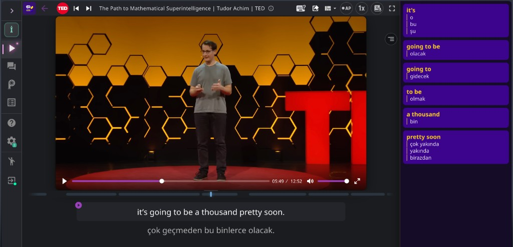

# Phrase Highlighter for Language Reactor

**English** | [Türkçe](README.tr.md) | [Español](README.es.md) | [简体中文](README.zh-Hans.md) | [Русский](README.ru.md)

A Chrome extension for people who learn languages with [Language Reactor](https://www.languagereactor.com). It only works on languagereactor.com. It does not work on youtube.com or netflix.com.

Open a lesson, then click the Phrase Highlighter icon (the first button on Language Reactor's bar). A sidebar opens on the right with meaning cards for the line you are on, not the whole video or book. Nested phrases both appear, for example `going to be` and `going to`. Meanings come from Language Reactor's own dictionary on the page. The Language Reactor website is enough. You do not need Language Reactor's Chrome extension.

## Install

This extension is not on the Chrome Web Store. Install it from the GitHub Releases zip.

1. Download the [v1.0.0 zip](https://github.com/official-burak/phrase-highlighter-for-language-reactor/releases/download/v1.0.0/phrase-highlighter-for-language-reactor-1.0.0.zip).
2. Unzip it.
3. In Chrome, open `chrome://extensions`.
4. Turn on Developer mode.
5. Click Load unpacked.
6. Choose the folder that contains `manifest.json`.

After an update, reload the extension on that page, then refresh the languagereactor.com tab.

## How to use

1. Install this Chrome extension (see Install).
2. Open [languagereactor.com](https://www.languagereactor.com).
3. Open a lesson (a video, book, podcast, or text).
4. Click the Phrase Highlighter icon on Language Reactor's toolbar. Color means the sidebar is open. Gray means it is closed, but you can still click it. Chrome remembers your choice.
5. Read the phrase cards for the current line. If that line has no phrases, the sidebar stays open and shows the extension logo until phrases appear.

## If the icon is missing

**Why don't I see it on YouTube.com?**

Watch through Language Reactor, not on youtube.com.

**The icon disappeared.**

Open a lesson. It is hidden on the catalog, saved items, settings, and home.

It only runs on Language Reactor. It does not send your lesson to extra servers. This project is not affiliated with Language Reactor or Dioco.

[Privacy](PRIVACY.md) · [Security](SECURITY.md) · [Contributing](CONTRIBUTING.md) · [MIT License](LICENSE). Copyright 2026 Burak Keskin.
